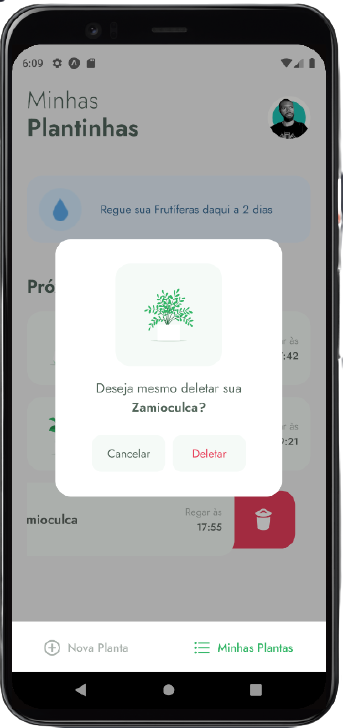

<h1 align="center" justifyContent="center">
  Plantmanager
  
</h1>

  

  

  

  

  

  

    
    

# :memo: About

This project was developed during the `Next Level Week` workshops by Rocketseat.

This app has a list of plants that user can choose for decorating your ambient.
The user can choose what plant better combine in your ambient, like what plant stay better in the
kitchen, living room, restroom and etc...and also the user can schedule an hour for taking an alert so he can care for your plant

### :rocket: Plus

I created exclusive features for my project and you can see the bellow list;

<ul>
  <li>The effect between the transaction of screens</li>
  <li>The dynamic text in the header of the application</li>
  <li>The custom modal to delete items</li>
  <li>The loading effect for a better user experience</li>
</ul>

# technologies

- [Expo](https://expo.io/)
- [React Native](https://reactnative.dev/)
- [TypeScript](https://www.typescriptlang.org/)
- [React Navigation](https://reactnavigation.org/)
- [React Native](https://reactnative.dev/)
- [React Native](https://reactnative.dev/)
- [Axios]()
- [Expo-font]()
- [vector-icons]()
- [lottie-react-native]()
- [date-fns]()
- [react-native-svg]()
- [ESlint]()
- [Prettier]()
- [Editorconfig]()

Make with 💜 by Héliton Oliveira
